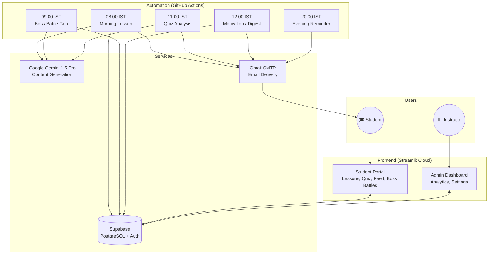

# 🐍 PyDaily: The AI-Powered Python Bootcamp

> **"1% Better Every Day"** – A fully automated, serverless Python learning platform that delivers personalized lessons, quizzes, and challenges to students daily via email and a web portal.

 [](https://pydaily.streamlit.app)  

---

## 📖 Table of Contents

1. [What is PyDaily?](#-what-is-pydaily)
2. [How It Works (For Students)](#-how-it-works-for-students)
3. [Features Overview](#-features-overview)
4. [Technical Architecture](#-technical-architecture)
5. [Daily Automation Schedule](#-daily-automation-schedule)
6. [Project Structure](#-project-structure)
7. [Key Modules Deep Dive](#-key-modules-deep-dive)
8. [Database Schema](#-database-schema)
9. [Setup & Deployment](#-setup--deployment)
10. [Maintenance Guide](#-maintenance-guide)
11. [License & Credits](#-license--credits)

---

## 🎯 What is PyDaily?

**PyDaily** is an **infinite learning engine** for Python. Unlike traditional courses where you watch videos and forget everything, PyDaily:

- **Delivers micro-lessons** (15 min/day) directly to your inbox
- **Generates content fresh daily** using Google Gemini AI
- **Tracks your progress** with streaks, quizzes, and achievements
- **Adapts to your level** with Boss Battles for advanced learners

Think of it as **Duolingo meets Python** – but smarter.

### Who Is This For?

| Audience | What You'll Get |
|----------|-----------------|
| **Complete Beginners** | Daily lessons from "What is Python?" to building real projects |
| **Working Professionals** | 15-minute daily practice to upskill without overwhelming your schedule |
| **College Students** | Gamified learning with streaks, quizzes, and challenges |

---

## 📬 How It Works (For Students)

### Daily Email Flow

```
┌─────────────────────────────────────────────────────────────────┐
│  08:00 AM  →  📧 Morning Lesson Email                           │
│              "Hey {Name}, here's today's lesson: Lists & Loops" │
│              + Code examples                                    │
│              + Challenge                                        │
│              + Deep Dive Link (Programiz/RealPython)            │
├─────────────────────────────────────────────────────────────────┤
│  12:00 PM  →  ⚡ Motivational Quote (Sun-Fri)                   │
│          or  📅 Weekly Digest (Saturday)                        │
│              - Your weekly progress                             │
│              - Quizzes attempted                                │
│              - Coming up next week                              │
├─────────────────────────────────────────────────────────────────┤
│  08:00 PM  →  🔔 Evening Reminder                               │
│              "Did you complete today's lesson?"                 │
│              + Teaser for tomorrow                              │
└─────────────────────────────────────────────────────────────────┘
```

### The Student Portal (Streamlit)

When students log in at [pydaily.streamlit.app](https://pydaily.streamlit.app), they see:

| Tab | Description |
|-----|-------------|
| **📚 Today's Lesson** | Full lesson content with code highlighting |
| **🧠 Quiz Arena** | 20-question quiz (Theory + Code) with instant feedback |
| **⚔️ Boss Battles** | Senior-dev level challenges (Day 10+) |
| **🎰 The Feed** | Doom-scrolling content: memes, facts, challenges, tips |
| **💪 Flashcard Gym** | Interactive coding drills |
| **🌌 Skill Constellation** | Visual map of your Python journey |

---

## ✨ Features Overview

### Core Learning Features

| Feature | Description |
|---------|-------------|
| **AI-Generated Lessons** | Fresh content generated daily by Google Gemini 1.5 Pro |
| **179-Day Curriculum** | Structured path from basics to advanced (with infinite extension) |
| **Daily Quizzes** | Every 3rd day is quiz day – tests knowledge retention |
| **Streak System** | Gamification: maintain your daily learning streak |
| **Deep Dive Links** | Each lesson links to Programiz/RealPython for further reading |

### Engagement Features

| Feature | Description |
|---------|-------------|
| **The Feed** | TikTok-style scrollable content with memes, facts, challenges |
| **Boss Battles** | Hard-mode challenges: "Build this WITHOUT using loops" |
| **Weekly Digest** | Saturday summary email with progress and upcoming topics |
| **Bookmarks** | Save lessons and nuggets for later review |
| **Spaced Repetition** | System reminds you of concepts you're forgetting |

### Instructor Features

| Feature | Description |
|---------|-------------|
| **Admin Dashboard** | View all students' progress, quiz scores, and activity |
| **Cohort Analytics** | See how your class is performing as a whole |
| **Manual Triggers** | Run any email cycle manually from GitHub Actions |
| **Pause/Resume** | Students can pause their learning and resume later |

---

## 🏗️ Technical Architecture

### High-Level Overview



### Tech Stack

| Layer | Technology | Purpose |
|-------|------------|---------|
| **Frontend** | Streamlit | Python-based reactive UI |
| **Database** | Supabase (PostgreSQL) | Student data, lessons, quizzes, feed |
| **AI Model** | Google Gemini 1.5 Pro | Content generation, quiz creation |
| **Automation** | GitHub Actions | Scheduled cron jobs (5 per day) |
| **Email** | Gmail SMTP | Lesson delivery, reminders |
| **Hosting** | Streamlit Cloud (Free) | Web app hosting |

---

## ⏰ Daily Automation Schedule

All times are in **IST (Indian Standard Time)**.

| Time (IST) | UTC Cron | Mode | What Happens |
|------------|----------|------|--------------|
| **08:00** | `30 2 * * *` | `morning` | Sends lesson email + generates Feed nuggets |
| **09:00** | `30 3 * * *` | `boss_cycle` | Generates Boss Battle challenges (separate workflow) |
| **11:00** | `30 5 * * *` | `insights` | AI analyzes quiz attempts, sends feedback emails |
| **12:00** | `30 6 * * *` | `motivation` | **Sat:** Weekly Digest / **Sun-Fri:** Motivational Quote |
| **20:00** | `30 14 * * *` | `evening` | Reminder email + promotes student to next day |

### What Each Mode Does

```
┌──────────────────────────────────────────────────────────────────┐
│  MORNING MODE                                                    │
│  ─────────────                                                   │
│  1. Get all students with status='pending'                       │
│  2. Group by their current day                                   │
│  3. For each day:                                                │
│     a. Generate lesson content (or get from cache)               │
│     b. If Quiz Day (every 3rd day): Send quiz email instead      │
│     c. Add {{NAME}} personalization                              │
│     d. Append Deep Dive Link                                     │
│     e. Send via Gmail                                            │
│  4. Generate 5 Feed nuggets for that day                         │
└──────────────────────────────────────────────────────────────────┘

┌──────────────────────────────────────────────────────────────────┐
│  EVENING MODE                                                    │
│  ────────────                                                    │
│  1. Get all students with status='lesson_sent'                   │
│  2. Send reminder email with tomorrow's teaser                   │
│  3. Update status → 'pending', day → day+1                       │
└──────────────────────────────────────────────────────────────────┘

┌──────────────────────────────────────────────────────────────────┐
│  MOTIVATION MODE                                                 │
│  ────────────────                                                │
│  If Saturday:                                                    │
│     → Send personalized Weekly Digest (no AI call)               │
│       - This Week's progress                                     │
│       - Quizzes taken/pending                                    │
│       - Coming Up next week                                      │
│       - Pro Tips                                                 │
│  Else (Sun-Fri):                                                 │
│     → Generate motivational quote via AI                         │
│     → Send to all active students                                │
└──────────────────────────────────────────────────────────────────┘
```

---

## 📂 Project Structure

```bash
PyDaily/
├── .github/workflows/           # GitHub Actions (Automation)
│   ├── daily_scheduler.yml      # Main scheduler (4 cycles)
│   └── boss_scheduler.yml       # Boss Battle generator
│
├── backend/                     # Core Business Logic
│   ├── curriculum.py            # 179-day topic map + Deep Dive links
│   ├── data_manager.py          # High-level data access layer
│   ├── db_supabase.py           # Supabase CRUD operations (33KB!)
│   ├── email_service.py         # HTML email templates + SMTP
│   ├── gemini_service.py        # AI prompt engineering (22KB)
│   └── lesson_manager.py        # Parses AI output into structured data
│
├── views/                       # Streamlit UI Components
│   ├── login.py                 # Authentication (Email + Google)
│   ├── unsubscribe.py           # Email preference management
│   ├── student/                 # Student Portal
│   │   ├── dashboard.py         # Main student dashboard
│   │   ├── quiz.py              # Quiz Arena
│   │   ├── feed.py              # The Feed (doom-scrolling)
│   │   └── components/          # Reusable UI components
│   │       ├── boss_battle.py   # Boss Battle challenges
│   │       ├── flashcard_gym.py # Coding drills
│   │       ├── expert_kit.py    # Advanced resources
│   │       └── ...
│   └── admin/                   # Instructor Dashboard
│       ├── analytics.py         # Cohort analytics
│       └── settings.py          # Admin settings
│
├── tools/                       # Utility Scripts
│   ├── generate_nuggets_v2.py   # Feed content generator
│   ├── feed_templates.py        # Prompt templates for feed
│   ├── admin/                   # Admin utilities
│   ├── content/                 # Content generation tools
│   ├── debug/                   # Debugging utilities
│   ├── migrations/              # Database migrations
│   └── sql/                     # Raw SQL scripts
│
├── assets/                      # Static files
│   ├── styles.css               # Global CSS
│   ├── setup_*.sql              # Database schema files
│   └── email_sample_*.html      # Email template samples
│
├── run_bot.py                   # Main CLI entry point (GitHub Actions)
├── run_boss_cycle.py            # Boss Battle generator script
├── streamlit_app.py             # Web app entry point
├── MAINTENANCE.md               # Troubleshooting guide
└── requirements.txt             # Python dependencies
```

---

## 🔧 Key Modules Deep Dive

### 1. Content Generation (`backend/gemini_service.py`)

The brain of PyDaily. This module contains all AI prompt engineering.

**Key Functions:**
- `generate_lesson(day, topic)` → Generates HTML lesson content
- `generate_quiz(day, topic)` → Creates 20-question quiz (12 theory + 8 code)
- `generate_motivation()` → Inspirational quotes
- `generate_class_insights(attempts, topic)` → Analyzes quiz mistakes

**How Lessons Are Generated:**
```python
prompt = f"""
You are a Python instructor. Generate a 15-minute lesson on: {topic}

Include:
1. Simple explanation with real-world analogy
2. 2-3 code examples with comments
3. A mini-challenge for practice

Format as HTML with proper syntax highlighting.
"""
response = gemini.generate_content(prompt)
```

### 2. The Feed Engine (`tools/generate_nuggets_v2.py`)

Generates 5 pieces of "doom-scrolling" content per day:

| Type | Description | Example |
|------|-------------|---------|
| `meme` | Python humor | "When you forget a colon: *surprised Pikachu*" |
| `fact` | Interesting facts | "Python was named after Monty Python, not the snake!" |
| `challenge` | Mini puzzles | "What does `'hello'[::-1]` return?" |
| `pro_tip` | Best practices | "Use `enumerate()` instead of `range(len())`" |
| `analogy` | Concept explanations | "A list is like a shopping cart..." |

### 3. Quiz System (`views/student/quiz.py`)

**Quiz Structure:**
- 12 Theory Questions (Multiple Choice)
- 8 Code Questions (What's the output?)
- Instant feedback with explanations
- Scores saved to `quiz_attempts` table

**Quiz Days:** Every 3rd day (Day 3, 6, 9, 12, ...)

### 4. Boss Battles (`run_boss_cycle.py`)

Advanced challenges for students who want more:

**Difficulty Scaling:**
| Day Range | Constraints |
|-----------|-------------|
| Day 10-19 | No loops allowed |
| Day 20-29 | No functions allowed |
| Day 30+ | Full Python, hard problems |

**Example Prompt:**
```
You are a Senior Software Architect.
Give a coding challenge: "Build a bank transaction system"
Constraint: Do NOT use any loops.
```

### 5. Email Service (`backend/email_service.py`)

Handles all email delivery:
- HTML template generation
- `{{NAME}}` placeholder replacement
- Gmail SMTP sending
- Batch delivery (one email to multiple recipients via BCC)

---

## 🗄️ Database Schema

PyDaily uses **Supabase** (PostgreSQL). Key tables:

| Table | Purpose |
|-------|---------|
| `profiles` | Student data (email, name, day, streak, status) |
| `daily_content` | Cached AI-generated lessons |
| `quiz_attempts` | Quiz scores and answers |
| `boss_battles` | Generated boss challenges |
| `feed` | Doom-scrolling content (nuggets) |
| `bookmarks` | Saved lessons and nuggets |
| `email_preferences` | Subscription settings |

### Student Status Flow

```
┌──────────┐  Morning   ┌─────────────┐  Evening   ┌──────────┐
│ pending  │ ─────────→ │ lesson_sent │ ─────────→ │ pending  │
│ (Day N)  │            │   (Day N)   │            │ (Day N+1)│
└──────────┘            └─────────────┘            └──────────┘
```

---

## ⚙️ Setup & Deployment

### Prerequisites

- Python 3.10+
- A Supabase account (free tier works)
- A Google Gemini API key
- A Gmail account (for SMTP)

### Local Development

```bash
# 1. Clone the repo
git clone https://github.com/maahi3793/PyDaily.git
cd PyDaily

# 2. Install dependencies
pip install -r requirements.txt

# 3. Create secrets file
# Create .streamlit/secrets.toml with:
```

```toml
# .streamlit/secrets.toml
SUPABASE_URL = "https://your-project.supabase.co"
SUPABASE_KEY = "your-anon-key"
SUPABASE_SERVICE_KEY = "your-service-key"
GEMINI_API_KEY = "your-gemini-key"
EMAIL_ADDRESS = "your-email@gmail.com"
EMAIL_PASSWORD = "your-app-password"
ADMIN_EMAIL = "admin@example.com"
```

```bash
# 4. Run the web app
streamlit run streamlit_app.py

# 5. Test email cycles manually
python run_bot.py --mode morning
python run_bot.py --mode evening
python run_bot.py --mode motivation
```

### Production Deployment

1. **Web App:** Push to GitHub → Connect to Streamlit Cloud → Add secrets
2. **Automation:** GitHub Actions run automatically. Set these secrets in repo settings:
   - `SUPABASE_URL`
   - `SUPABASE_SERVICE_KEY`
   - `GEMINI_API_KEY`
   - `EMAIL_ADDRESS`
   - `EMAIL_PASSWORD`
   - `ADMIN_EMAIL`

---

## 🛠️ Maintenance Guide

See [MAINTENANCE.md](MAINTENANCE.md) for detailed troubleshooting.

### Quick Reference

| Issue | Solution |
|-------|----------|
| Emails not sending | Check Gmail app password, quota (500/day) |
| AI content empty | Check Gemini API key and quota |
| Quiz not saving | Verify Supabase connection and RLS policies |
| GitHub Action failed | Check UTC time windows in `daily_scheduler.yml` |

### Manual Triggers

Each cycle can be triggered manually from GitHub Actions:
1. Go to Actions tab → Select workflow
2. Click "Run workflow"
3. Choose the cycle (Morning/Evening/Motivation/Insights)

---

## 🛡️ License & Credits

- **Author:** Maahi3793 & The Antigravity Team
- **License:** MIT License
- **Status:** Active Development (Phase 15)

---

> *"Code is poetry written for machines. PyDaily makes learning it a daily habit."* 🐍
