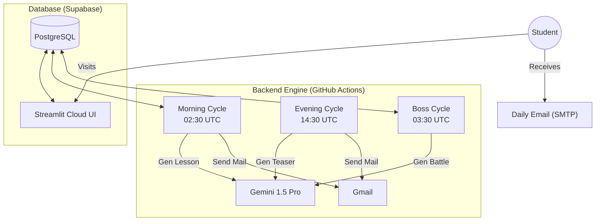

# 🐍 PyDaily: The AI-Powered Python Bootcamp

> **"1% Better Every Day"** – A fully automated, AI-driven Python learning platform that generates personalized curriculum, interactive quizzes, and "Boss Battle" challenges for students daily.

 [](https://pydaily.streamlit.app)  

---

## 📖 Overview

**PyDaily** is not just a course; it's an **infinite learning engine**. Built on the philosophy of micro-learning, it delivers bite-sized Python lessons via email and interaction through a rich Student Portal.

### 🌟 Key Features
*   **🤖 AI-Generated Curriculum:** The standard curriculum is mapped (Day 1-215), but the *content*, *examples*, and *quizzes* are generated fresh by **Google Gemini 1.5 Pro** every morning.
*   **📧 Automated Email Delivery:** Students receive their daily lesson at 08:00 AM (IST) and a reminder/teaser at 08:00 PM (IST).
*   **⚔️ Boss Battle Engine:** Advanced students face "Senior Dev" level challenges with strict syntax constraints (e.g., "Solve this without loops").
*   **🏋️ Flashcard Gym:** An interactive coding carousel for daily drills.
*   **📊 Instructor Dashboard:** Real-time analytics on cohort pacing, quiz performance, and "Paused" students.

---

## 🏗️ Technical Architecture

This project uses a **Serverless-First** approach to minimize maintenance costs while maximizing reliability.



### 🛠️ Tech Stack
*   **Frontend**: [Streamlit](https://streamlit.io) (Python-based reactive UI).
*   **Backend Logic**: Python 3.10 (`backend/` module).
*   **Database**: [Supabase](https://supabase.com) (PostgreSQL + JSONB).
*   **AI Model**: Google Gemini 1.5 Pro (via `google-generativeai` SDK).
*   **Automation**: GitHub Actions (Cron Jobs).
*   **Email**: Gmail SMTP Server.

---

## 📂 Project Structure

```bash
PyDaily/
├── .github/workflows/       # Automation Schedulers
│   ├── daily_scheduler.yml  # Morning/Evening Emails
│   └── boss_scheduler.yml   # Boss Battle Generator
├── assets/                  # CSS and Static Images
├── backend/                 # Core Business Logic
│   ├── db_supabase.py       # Database Interface (CRUD)
│   ├── gemini_service.py    # AI Prompt Engineering
│   ├── email_service.py     # HTML Email Templates & SMTP
│   └── curriculum.py        # 215-Day Topic Map
├── tools/                   # Utility Scripts (Admin ops, patches)
├── views/                   # Streamlit UI Components
│   ├── student/             # Student Portal (Dashboard, Quiz, Gym)
│   └── admin/               # Instructor Dashboard (Analytics)
├── run_bot.py               # Main Entry Point for CLI/Automation
└── streamlit_app.py         # Main Entry Point for Web App
```

---

## 🚀 Key Modules Deep Dive

### 1. The Lesson Engine (`backend/lesson_manager.py`)
Parses raw AI output into structured data:
*   Extracts **Theory**, **Code Snippets**, and **Challenge** blocks.
*   Formats content into beautiful HTML emails.
*   caches content in Supabase `daily_content` for web display.

### 2. The Boss Battle Engine (`run_boss_cycle.py`)
A separate, high-difficulty generator for advanced learners.
*   **Curriculum Aware**: 
    *   *Day < 10*: Forbids Loops/Functions (Forces basic logic).
    *   *Day < 20*: Allows Loops (Forbids Classes).
*   **Scenario Based**: "You are a Bank Systems Architect..."

### 3. The Quiz Arena (`views/student/quiz.py`)
*   **Adaptive Testing**: 12 Theory Questions + 8 Code Snippets.
*   **Instant Feedback**: Explains *why* an answer was wrong.
*   **Streak Tracking**: Gamifies consistency.

---

## ⚙️ Setup & Deployment

### Local Development
1.  **Clone the Repo**
    ```bash
    git clone https://github.com/maahi3793/PyDaily.git
    cd PyDaily
    ```
2.  **Install Dependencies**
    ```bash
    pip install -r requirements.txt
    ```
3.  **Secrets Management**
    Create a `.secrets.toml` inside `.streamlit/` for local runs:
    ```toml
    SUPABASE_URL = "https://your-project.supabase.co"
    SUPABASE_KEY = "your-anon-key"
    GEMINI_API_KEY = "your-gemini-key"
    ```
4.  **Run the App**
    ```bash
    streamlit run streamlit_app.py
    ```

### Production Deployment
*   **Web App**: Push to GitHub. Connect repo to **Streamlit Community Cloud**. Add secrets in the Streamlit Dashboard.
*   **Automation**: The `.github/workflows` folder automatically schedules the bots. Ensure GitHub Actions Secrets are set for `GEMINI_API_KEY`, `SUPABASE_SERVICE_KEY`, etc.

---

## 🛡️ License & Credits

*   **Author**: Maahi3793 & The Antigravity Team.
*   **License**: MIT License.
*   **Status**: Active Maintenance (Phase 12 Complete).

> *"Code is poetry written for machines."* 🐍
